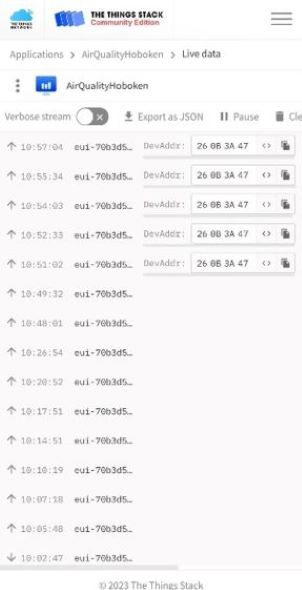
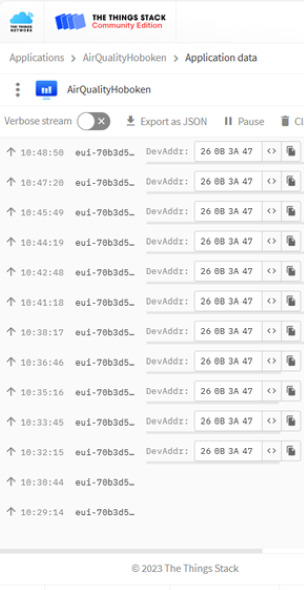

## Vergelijking communicatie AP – Hobokense Polder

De dekking in zowel AP als de Hobokense polder ziet er redelijk goed uit. Op de campus hebben we nog geen probleem gehad met de dekking. Tijdens het bezoek naar de Hobokense Polder hebben we gemerkt dat we gedurende 20 min geen data meer aankregen. We zien das dat de dekking in de Hobokense polder niet zo goed is als op AP, hier gaan we dus rekening mee moeten houden bij het plaatsen van onze sensoren.

